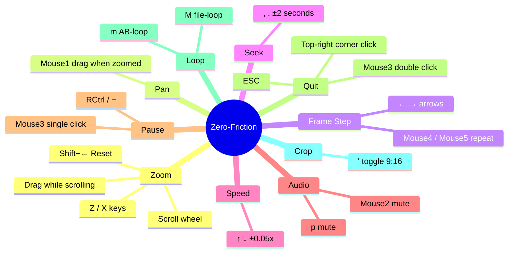

# mpv.net Zero-Friction v0.6

A zero-friction video workstation config for [mpv.net](https://github.com/mpvnet-player/mpv.net) on Windows. Designed for one-handed right-side operation with a 5-button mouse.

Every binding exists because the default required two hands, a menu, or too many clicks. The goal is: eyes on the video, one hand on the mouse, everything within reach.

## Install

Copy to `%AppData%\mpv.net\`:

```
mpv.conf, input.conf, mpvnet.conf  → root
scripts/*.lua                      → scripts/
```

Restart mpv.net after any change.

## Bindings



### Why these specific bindings

**Mouse1 = drag-to-pan.** When zoomed into a video, you need to move around. Drag is the only natural gesture for this — anything else breaks flow. When not zoomed, the click falls through to mpv defaults.

**Mouse2 = mute.** Instant, no delay, no confirmation. You hear something you don't want to hear, you click. One of the most-used actions needs the fastest path.

**Mouse3 = pause (single) / quit (double).** Middle click is awkward to press, which makes it a natural guard against accidental quits. Single click pauses with a 300ms delay (waiting to see if a double-click follows). Double click quits immediately.

**Mouse4/5 = frame repeat.** Side buttons simulate held arrow keys for continuous frame-by-frame scrubbing. Hold Mouse4 to scrub backward, Mouse5 to scrub forward. The repeat starts after 200ms, then accelerates to 50ms intervals.

**Scroll wheel = zoom toward cursor.** The point under your cursor stays fixed while the image scales around it. You can scroll while dragging (MBTN_LEFT+WHEEL combo) to zoom and pan simultaneously.

**Top-right corner = invisible exit.** A 90px invisible zone in the top-right corner. Click there to quit. Works even when the seekbar is broken (see Known Issues). Same technology as the ghost bar.

**ESC = emergency exit.** Always works, no conditions. For when everything else fails.

## Ghost Mode OSC

The bottom bar is invisible but fully active. A 224px hit zone at the bottom of the screen receives all mouse events — seeking, time display, window controls — without any visible UI. The bar never appears, but every click in that zone works exactly like a visible seekbar would.

This is achieved by forcing `visibility=always` in the OSC while suppressing `render_elements()`. The mouse areas stay permanently active; only the drawing is skipped.

## Known Issues

**The ghost seekbar breaks after aggressive zoom+pan.** When you zoom in and make rapid circular mouse movements against the pan boundaries, the OSC's internal mouse tracking state (`mouse_in_window`) gets corrupted. The seekbar stops responding to clicks.

**Workaround:** Press ESC or click the top-right corner to quit and reopen. The corner exit was specifically added for this — it uses a separate forced binding group that survives the OSC corruption.

**Root cause:** mpv's OSC was never designed for 60fps property mutations. The zoom script writes `video-zoom`, `video-pan-x`, and `video-pan-y` on every scroll tick. A pan debounce at boundaries reduces the event flood (redundant writes are skipped when pan values are clamped), but it doesn't fully prevent the issue. The fix likely requires changes to osc.lua's `mouse_in_window` state machine, or replacing the stock OSC entirely.

**Contributions welcome** — if you can fix the `mouse_in_window` desync in osc.lua without breaking the ghost mode rendering pipeline, that would promote this project to v1.0.

## Files

| File | Purpose |
|---|---|
| `mpv.conf` | Engine settings, OSC ghost mode config, OSD suppression |
| `input.conf` | All bindings (8 sections) |
| `mpvnet.conf` | Multi-instance support |
| `scripts/drag-to-pan.lua` | Mouse1 drag panning when zoomed in |
| `scripts/zoom-toward-cursor.lua` | Zoom-toward-cursor with pan debounce |
| `scripts/double-right-quit.lua` | Mouse3 single=pause, double=quit |
| `scripts/mouse-repeat.lua` | Side button frame-step repeat |
| `scripts/corner-exit.lua` | Invisible quit zone, top-right corner |
| `scripts/osc.lua` | Heavily modified stock OSC with ghost mode |

## Contributing

Ideas and PRs welcome. Some directions that would be interesting:

- **Fix the ghost seekbar desync** — the v1.0 blocker. The `mouse_in_window` state in osc.lua gets corrupted by rapid property changes during zoom. Needs someone who understands mpv's OSC event pipeline deeply.
- **MMO mouse support** — A 12-button side grid would turn this into a full editing workstation. Frame step, seek, speed, loop points, markers — all under your thumb. If you have an MMO mouse and want to design a binding layout, open an issue.
- **Configurable corner exit** — size, position, or multiple corners for different actions.
- **Smooth zoom interpolation** — replace the discrete scroll steps with an animated zoom that eases between levels.

## License

Config files and custom Lua scripts are public domain. `scripts/osc.lua` is a modified version of mpv's stock OSC and retains its original license (GPLv2+).
